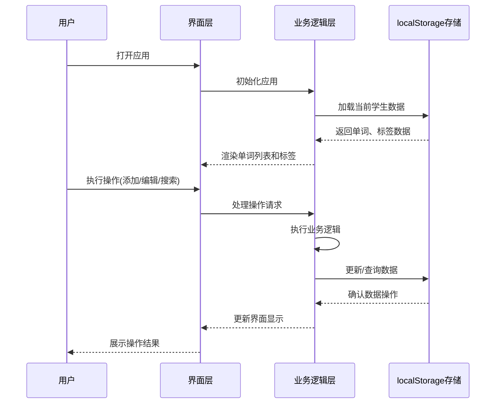

# 浏览器端单词管理系统项目介绍

## 1. 仓库概览

浏览器端单词管理系统是一款专注于英语学习辅助的轻量级Web应用，旨在帮助用户高效管理、复习和导出英语单词。系统通过浏览器本地存储实现数据持久化，无需后端服务器支持，提供单词维护、标签管理、搜索筛选以及Excel导入导出等核心功能。

### 主要功能/亮点

- **多学生管理**：支持在同一浏览器中为不同学生管理独立的单词库
- **完整的单词管理**：添加、编辑、删除单词，支持详细的复习记录跟踪（最多6次复习）
- **标签化分类**：自定义标签体系，支持灵活的标签管理和按标签搜索
- **批量操作**：支持批量修改单词标签、状态和复习记录
- **Excel导入导出**：支持单词数据的Excel模板下载、数据导入和结构化导出
- **状态筛选**：可快速筛选已掌握/未掌握单词，优化学习效率
- **本地数据存储**：基于浏览器localStorage的数据持久化，保护用户隐私

### 典型应用场景

- 个人英语学习者用于管理和复习新学单词
- 英语教师为多名学生维护单词库并跟踪学习进度
- 学生通过批量导入快速建立个人单词表并定期导出复习记录

## 2. 目录结构

项目采用简洁的前端工程结构，遵循标准的Web应用组织方式。HTML文件负责页面结构和组件定义，CSS文件提供全面的样式支持，JavaScript文件实现所有业务逻辑和数据处理。项目结构清晰，分工明确，便于维护和扩展。所有数据均存储在浏览器的localStorage中，无需后端服务器支持。

```text
d:\Program Files\projects\vocabulary-mananger/
├── index.html        # 主页面，包含所有界面组件和DOM结构
├── style.css         # 样式文件，定义所有界面元素的外观和交互效果
├── app.js            # 主逻辑文件，实现所有功能和数据处理
└── 浏览器端单词管理系统.md # 项目需求设计文档
```

* **index.html**：定义了系统的完整HTML结构，包括顶部导航栏、搜索区、单词列表表格以及各种功能模态框（添加/编辑单词、标签管理、批量操作等）。
* **style.css**：提供了全面的样式定义，确保界面美观、响应式并具有良好的用户体验。
* **app.js**：包含所有JavaScript逻辑，实现数据存储、业务功能和用户交互，是系统的核心文件。
* **浏览器端单词管理系统.md**：详细的需求设计文档，描述了系统的功能需求、非功能需求和数据模型。

## 3. 系统架构与主流程

系统采用典型的前端单页应用架构，基于纯JavaScript实现，不依赖任何前端框架。整体架构围绕数据存储和业务功能模块展开，通过事件驱动的方式响应用户操作。

### 架构概述

- **数据层**：使用浏览器localStorage作为持久化存储，按学生维度分离数据，实现多用户隔离
- **功能模块层**：包括单词管理、标签管理、搜索筛选、批量操作、Excel导入导出等核心功能模块
- **视图层**：基于HTML和CSS构建的用户界面，通过JavaScript动态更新内容
- **交互层**：事件监听和处理机制，响应用户操作并触发相应功能

### 数据存储设计

系统采用了规范化的数据存储模式，将数据分为三个主要部分：

1. **单词数据**：存储单词基本信息和复习记录
2. **标签数据**：存储自定义标签信息
3. **单词-标签关联数据**：存储单词与标签之间的多对多关系

每个学生的数据都通过独立的存储键进行隔离，确保数据互不干扰。

### 主流程图



## 4. 核心功能模块

### 4.1 单词管理模块

单词管理是系统的核心功能，支持单词的全生命周期管理，包括添加、编辑、删除和状态跟踪。

- **单词添加**：支持输入单词、中文释义，并可同时关联多个标签（选择已有标签或创建新标签）
- **单词编辑**：修改单词信息、调整标签关联、更新复习记录状态
- **单词删除**：支持单个删除，删除前进行二次确认
- **状态管理**：每个单词可标记为"已掌握"或"未掌握"，并可跟踪6次复习记录

单词数据结构包含序号、单词、释义、复习状态和创建时间等字段，通过localStorage进行持久化存储。

### 4.2 标签管理模块

标签系统提供了灵活的单词分类方式，帮助用户更好地组织和检索单词。

- **标签创建**：自定义标签名称，系统自动校验标签唯一性
- **标签编辑**：修改现有标签名称，关联的单词自动同步更新
- **标签删除**：删除标签时会提示关联单词数，删除后仅解除关联关系，不影响单词本身
- **标签展示**：以复选框形式展示所有标签，方便用户选择和管理

标签管理通过独立的标签表和单词-标签关联表实现，确保数据的一致性和查询效率。

### 4.3 搜索与筛选模块

强大的搜索和筛选功能使用户能够快速定位所需单词，提高学习效率。

- **标签搜索**：支持选择多个标签进行组合搜索，结果为同时关联所有选中标签的单词
- **状态筛选**：可根据单词状态（已掌握/未掌握/全部）进行筛选
- **排序功能**：支持按单词序号升序或降序排列
- **清空筛选**：一键清除所有搜索条件，返回完整单词列表

搜索结果实时更新，提供即时反馈，用户体验流畅。

### 4.4 Excel导入导出模块

Excel功能支持数据的批量操作和外部处理，增强了系统的灵活性和兼容性。

- **模板下载**：提供标准Excel模板，方便用户按格式准备数据
- **数据导入**：支持批量导入单词数据，包含单词、释义、标签和复习状态等信息
- **导入验证**：对导入数据进行格式验证，提供详细的错误信息和导入统计
- **数据导出**：将单词数据导出为Excel文件，包含所有相关字段和复习记录

导入导出功能基于js-xlsx库实现，在浏览器端完成所有数据转换和文件生成。

### 4.5 批量操作模块

批量操作功能大幅提升了管理效率，特别适合处理大量单词数据。

- **批量标签修改**：支持对多个单词同时添加、替换或移除标签
- **批量状态更新**：可将多个单词批量标记为已掌握或未掌握
- **批量复习记录管理**：同时更新多个单词的复习状态，或清空复习记录
- **全选/取消选择**：支持快速选择或取消选择所有单词

批量操作通过模态框实现，操作前清晰显示选择数量，提供友好的用户提示。

## 5. 核心 API/类/函数

系统的核心功能通过以下关键函数实现，这些函数构成了应用的骨架：

### 5.1 数据存储与检索

- **getStorageKey(keyPrefix)**：根据当前学生生成存储键，实现数据隔离
  - 参数：keyPrefix - 存储键前缀
  - 返回值：完整的存储键字符串

- **getAllWords()**：获取当前学生的所有单词数据
  - 返回值：单词对象数组

- **saveAllWords(words)**：保存所有单词数据到localStorage
  - 参数：words - 要保存的单词数组

- **getAllTags()**：获取当前学生的所有标签数据
  - 返回值：标签对象数组

- **getAllWordTags()**：获取当前学生的所有单词-标签关联数据
  - 返回值：关联对象数组

### 5.2 单词管理功能

- **saveWord()**：保存单词数据，包括新增和编辑
  - 功能：验证表单数据，处理新增/编辑逻辑，保存单词和关联标签
  - 副作用：更新localStorage中的单词数据和关联关系，刷新界面

- **deleteWord(wordId)**：删除指定ID的单词
  - 参数：wordId - 要删除的单词ID
  - 功能：执行二次确认，删除单词及相关联的数据，更新界面

- **loadWordList()**：加载并渲染单词列表
  - 功能：获取单词数据，应用搜索和筛选条件，渲染表格内容
  - 副作用：更新DOM中的单词列表和统计信息

### 5.3 标签管理功能

- **saveWordTags(wordId)**：保存单词的标签关联
  - 参数：wordId - 单词ID
  - 功能：处理单词与标签的关联关系，保存到localStorage

- **addTag()**：添加新标签
  - 功能：验证标签名称唯一性，生成新标签ID，保存标签数据

- **deleteTag(tagId)**：删除指定ID的标签
  - 参数：tagId - 要删除的标签ID
  - 功能：提示关联单词数量，删除标签并解除所有关联关系

### 5.4 搜索与筛选

- **searchWords()**：根据选定的标签搜索单词
  - 功能：收集选中标签，过滤出符合条件的单词，更新单词列表

- **filterWordsByStatus()**：根据状态筛选单词
  - 功能：根据当前选择的状态（已掌握/未掌握/全部）过滤单词列表

### 5.5 Excel导入导出

- **exportToExcel()**：导出单词数据为Excel文件
  - 功能：收集单词数据，转换为Excel格式，生成并下载文件

- **importExcelFile(event)**：处理Excel文件导入
  - 参数：event - 文件选择事件
  - 功能：读取Excel文件，解析数据，验证格式，导入有效数据

### 5.6 批量操作

- **saveBatchTags()**：批量修改单词标签
  - 功能：根据选择的操作模式（替换/添加/移除）批量更新单词标签

- **saveBatchStatus()**：批量修改单词状态
  - 功能：将选中的单词批量标记为已掌握或未掌握

- **saveBatchReview()**：批量修改单词复习记录
  - 功能：批量设置或清空多个单词的复习状态

### 5.7 用户界面与交互

- **openAddWordModal()/openEditWordModal(wordId)**：打开添加/编辑单词的模态框
  - 参数：wordId - 编辑模式下的单词ID
  - 功能：初始化表单，加载标签和已有数据（编辑模式），显示模态框

- **openTagManageModal()**：打开标签管理模态框
  - 功能：加载标签列表，显示管理界面

- **showToast(message, type)**：显示提示消息
  - 参数：message - 消息内容，type - 消息类型（success/error/info）
  - 功能：在页面右下角显示临时消息提示

## 6. 技术栈与依赖

| 技术/依赖          | 版本     | 用途                      | 来源                      |
|-----------------|--------|-------------------------|------------------------|
| HTML5           | -      | 页面结构与语义化标记              | 标准Web技术                |
| CSS3            | -      | 界面样式与响应式设计              | 标准Web技术                |
| JavaScript      | ES6+   | 业务逻辑与交互处理               | 标准Web技术                |
| localStorage    | -      | 本地数据持久化存储               | 浏览器API                 |
| xlsx            | 0.18.5 | Excel文件的解析与生成           | CDN: https://cdnjs.cloudflare.com/ajax/libs/xlsx/0.18.5/xlsx.full.min.js |
| Font Awesome    | -      | 图标资源（通过浏览器默认字体模拟）      | 内联样式实现                |

系统设计轻量简洁，除必要的Excel处理库外，不依赖其他外部框架，确保了应用的高性能和快速加载。

## 7. 关键模块与典型用例

### 7.1 单词管理用例

**功能说明**：管理单词库，包括添加、编辑、删除单词及其相关信息。

**配置与依赖**：无特殊配置，所有数据自动保存到浏览器localStorage。

**使用示例**：

```javascript
// 添加新单词
// 1. 点击"添加单词"按钮，触发openAddWordModal()
openAddWordModal();
// 2. 填写表单，点击保存按钮，触发saveWord()
saveWord(); // 内部会处理表单验证、创建单词对象、保存到localStorage并刷新界面

// 编辑单词
// 1. 点击单词行的"编辑"按钮，传入单词ID
openEditWordModal(1); // 打开ID为1的单词编辑界面
// 2. 修改信息，点击保存
```

### 7.2 标签管理与搜索用例

**功能说明**：创建和管理标签，并使用标签搜索相关单词。

**使用示例**：

```javascript
// 创建标签
// 1. 点击"标签管理"按钮
openTagManageModal();
// 2. 输入标签名称，点击"添加标签"
addTag(); // 内部会验证标签唯一性并保存

// 标签搜索
// 1. 在标签选择器中勾选多个标签
// 2. 点击"搜索"按钮
searchWords(); // 内部会过滤出同时包含所有选中标签的单词
```

### 7.3 Excel导入导出用例

**功能说明**：下载Excel模板、批量导入单词数据和导出单词列表。

**使用示例**：

```javascript
// 下载模板
downloadExcelTemplate(); // 生成并下载标准格式的Excel模板

// 导入数据
// 1. 点击"导入Excel"按钮，触发文件选择对话框
// 2. 选择准备好的Excel文件，内部会处理导入逻辑
importExcelFile(event); // 解析文件，验证数据，导入有效记录，显示导入结果

// 导出数据
exportToExcel(); // 收集当前单词列表（或搜索结果），导出为Excel文件
```

## 8. 配置、部署与开发

### 8.1 部署方式

本项目为纯静态网站，无需服务器支持，部署极为简单：

1. 将所有文件（index.html、style.css、app.js）复制到任何Web服务器或静态文件托管服务
2. 通过浏览器访问index.html文件即可使用
3. 也可直接在本地双击index.html文件打开使用

### 8.2 浏览器兼容性

- Chrome (≥ 90)
- Edge (≥ 90)
- Firefox (≥ 88)
- Safari (≥ 14)

### 8.3 开发指南

如需对系统进行扩展或修改，建议遵循以下步骤：

1. 克隆或下载项目文件
2. 在任意文本编辑器中修改相应文件：
   - index.html：调整界面结构或添加新组件
   - style.css：修改样式或添加新样式规则
   - app.js：实现新功能或修改现有逻辑
3. 修改后直接在浏览器中刷新页面查看效果

## 9. 监控与维护

### 9.1 数据备份与恢复

系统数据存储在浏览器localStorage中，建议定期导出数据进行备份：

1. 使用"导出Excel"功能将数据保存为文件
2. 需要恢复时，使用"导入Excel"功能重新导入数据

### 9.2 常见问题排查

- **数据不保存**：检查浏览器localStorage是否被禁用或存储空间已满
- **导入失败**：确认Excel文件格式正确，字段匹配模板要求
- **标签搜索无结果**：确保选择的标签组合存在匹配的单词
- **浏览器兼容性问题**：确认使用的浏览器版本符合要求

## 10. 总结与亮点回顾

浏览器端单词管理系统是一款专为英语学习者设计的实用工具，其主要亮点包括：

1. **零依赖部署**：纯前端实现，无需服务器支持，随时随地可用
2. **数据本地存储**：保护用户隐私，无需担心数据泄露风险
3. **多学生管理**：同一浏览器支持多个学生独立使用，适合家庭或教学场景
4. **完整的单词生命周期管理**：从添加到复习跟踪，全方位支持单词学习
5. **灵活的标签系统**：自定义分类方式，满足不同学习需求
6. **强大的批量操作**：提高数据管理效率，适合处理大量单词
7. **完善的导入导出**：与外部工具无缝衔接，扩展使用场景

系统设计简洁高效，界面友好直观，功能丰富实用，为用户提供了一个轻量级但功能完备的单词学习辅助工具。通过浏览器本地存储技术，在保证数据安全的同时，实现了跨会话的数据持久化，满足了个人和教学场景下的单词管理需求。